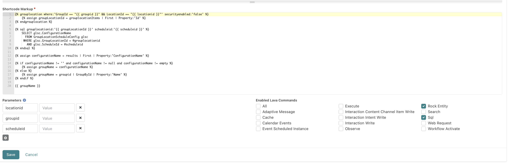

# projectname Shortcode

## Tag Type
inline

## Description
A Sign-Up project can have unique names for each occurrence. If none is configured, it'll use the group's name. Given the GroupId, LocationId, and ScheduleId, it'll provide the configuration name if there is one or the group name if there isn't.

## Parameters locationid
- locationid
- groupid
- scheduleid

## Enabled Lava Commands
- Rock Entity
- Sql

